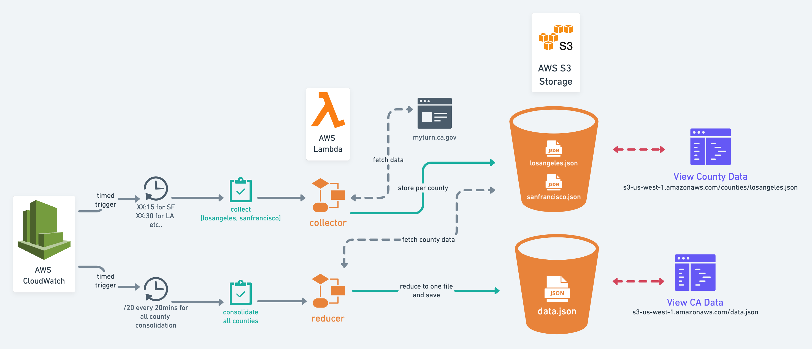

# Vaccine Availability Aggregator: California MyTurn State System

## Overview

These services collect data for the CA state vaccination system (MyTurn) to expose a consolidated JSON payload to show the latest vaccine availabilities for all supported vaccine clinics on the platform in all 58 counties.

## MyTurn Data Collection Methodology & Assumptions

### Patient Eligibility
As part of data collection, we are assuming eligibility for the vaccine and that vaccine availabilities are not segmented by patient cohort. The script can be adapted if inventory is in fact segmented, but collection would be much slower (as we would need to query each location for each possible cohort [16-49+Education, 16+49+FoodAgriculture, etc.]).

We are using `75 and older` and `Other` in the query, as this will continue to remain an eligible profile. We just need a valid user cohort to look up availabilities for all locations.

### Geography Selection
We are using hard-coded latitude and longitude values in the location geo search depending on the county. That is, to search for LA county locations we are querying for available locations from a fixed lat/long in the middle of downtown LA. This will give us a list of locations in and around LA for LA county.

To add support for more counties, we just need to define fixed lat/long values in the collector script for each county. Refer to the `COUNTY_LAT_LONG` constant.

### Dose Availability Criteria

For both Pfizer and Moderna, there is a two dose requirement where both appointments must be booked 21 days and 28 days apart, respectively. This impacts our availability search in the following ways:

#### Dose 1 Availability Criteria

MyTurn will sometimes return dose 1 availabilities that can have one of these issues:

1. Today's date will be included in the **available dates** but all the time slots for that day will have already occurred; therefore, there are actually no availabilities for today. If today's date is included in the dose 1 availability response, we will do an additional check to look into the available time slots for the day and remove today's date if there are no time slots that are _after_ the data collection time.

2. Dates will be included that do not have time slot availabilities. We will do additional checks to ensure there is at least one time slot available and include the set of time slots in the JSON payload.

#### Dose 2 Availability Criteria

Dose 2 appointment availabilities are dependent on when the patient receives the first dose.

As such, we will only search for dose 2 availabilities 21 (or 28) days after the first available date that is offering the first dose. That is, within the dose 1 dates provided, we see that "2021-01-01" is the first date out of all the dates that has a time slot available to book. We will then add 21 or 28 days to this date and that is the "startDate" for our dose 2 query.

This is because both doses are booked at the same time, so if there is an availability for dose 2 tomorrow, it won't be useful as that will be too soon to book — it needs to be 21 (or 28) days after the first dose.

We will do a cheap check to see if the word `moderna` is in the location title to decide whether to add 21 or 28 days. We default to 21 days.

## Architecture



## Collector

The collector's job is to fetch location metadata info and dose availabilities for a set of counties. The event message payload that the lambda function expects includes an array of counties. This allows us to fan-out and collect a subset of counties so that we aren't bombarding the MyTurn service. 

We can collect `["Los Angeles", "San Diego"]` during one function invocation and `["Alameda", "Berkeley"]` in a separate invocation. This makes it easier to scale out collection.

During the function's execution, for each county, the collected data set will be written to `/counties/COUNTY_NAME_HERE.json` where `COUNTY_NAME_HERE` is the county's name lower-cased and with spaces removed.

If a client only wants to see LA county data, they could query the S3 resource: `/counties/losangeles.json`.

### Event Payload to Collector Lambda Function
[Example Collector Event Payload [JSON]](./collector/events/collector-event.json)

## Reducer

The reducer's job is to read each county artifact in S3 from the `/counties` prefix and merge all county data sets to produce one consolidated data set for the entire state. This is written to `data.json` in the root of the S3 bucket. 

This allows us to isolate the larger task of combining the entire state's data, such that we don't have one function invocation whose job is to do all of the work which could take a lot of time as we iterate through each individual county (and would cause high traffic against MyTurn).

### Event Payload to Reducer Lambda Function
[Example Reducer Event Payload [JSON]](./reducer/events/reducer-event.json)

## Local Development

> **This doc uses an example value `my-vaccine` throughout for what to name your buckets/functions/services. Change this value to whatever you choose to call your project.**

### AWS CLI

Install the [aws-cli](https://aws.amazon.com/cli/) and [configure with your admin user](https://docs.aws.amazon.com/cli/latest/userguide/cli-configure-quickstart.html). For a simple environment for experimenting, you can create a IAM user for your AWS account that has Administrator access and use that AWS Access Key ID and Secret Access Key. Configure your local environment with `aws configure`. 

### AWS SAM CLI
The [AWS SAM CLI](https://docs.aws.amazon.com/serverless-application-model/latest/developerguide/serverless-sam-cli-install.html) is a set of tools for serverless app development with AWS.

> The AWS SAM CLI is an extension of the AWS CLI that adds functionality for building and testing Lambda applications. It uses Docker to run your functions in an Amazon Linux environment that matches Lambda. It can also emulate your application's build environment and API.
>
> To use the AWS SAM CLI, you need the following tools:
> * AWS SAM CLI - [Install the AWS SAM CLI](https://docs.aws.amazon.com/serverless-application-model/latest/developerguide/serverless-sam-cli-install.html).
> * Node.js - [Install Node.js 14](https://nodejs.org/en/), including the npm package management tool. (Install `nvm` to easily manage multiple versions)
> * Docker - [Install Docker community edition](https://hub.docker.com/search/?type=edition&offering=community).

#### AWS SAM CLI Usage

We could leverage AWS SAM and Cloud Formation to the fullest extent but this is currently a bare bones project to get something running. You can use `sam` to build and invoke the function locally:

Enter whichever project you're trying to run (either `collector/` or `reducer/`) and build the project which will create a `.aws-sam` build directory with artifacts.

```
sam build
```

Then invoke the function locally with
```
sam local invoke -e events/collector-event.json myVaccineCollector
```
 or
 ```
sam local invoke -e events/reducer-event.json myVaccineReducer
```

You can attach a debugger with this command (Refer to [Debugging Lambda Functions Locally](https://www.moesif.com/blog/technical/serverless/debug-lambda-functions-locally-with-the-sam-cli-and-vscode/)):
```
sam local invoke -d 9999 -e events/collector-event.json myVaccineCollector
```

### Create and Update your Lambda function in AWS
Ensure you have `aws-cli` installed and it's configured with your AWS environment (credentials configured in your local system: verify with `$ vi ~/.aws/credentials`)

#### Creating Collector Function for the first time programmatically
1. cd into the collector module `cd collector` 
2. Run `npm run-script build` (this will run `npm install` and package the build artifacts into a zip file which we will upload to AWS)
3. Create the function using aws-cli. Ensure your you use the correct role ARN that you set up. We are defining some function defaults like: 
    * function should time out after 45 seconds 
    * the function entrypoint is in the collector.js `handler` function 
    * function should deploy with nodeJS v14
```
aws lambda create-function --function-name collector \
--zip-file fileb://collector.zip --handler collector.handler --runtime nodejs14.x \
--role arn:aws:iam::1234567890:role/my-vaccine-data-prod --timeout 45 
```

#### Creating Reducer Function for the first time programmatically
_Same process as with collector_
1. cd into the reducer module `cd reducer` 
2. Run `npm run-script build` (this will run `npm install` and package the build artifacts into a zip file which we will upload to AWS)
3. Create the function using aws-cli. Ensure your you use the correct role ARN that you set up. We are defining some function defaults like: 
    * function should time out after 45 seconds 
    * the function entrypoint is in the reducer.js `handler` function 
    * function should deploy with nodeJS v14
```
aws lambda create-function --function-name reducer \
--zip-file fileb://reducer.zip --handler reducer.handler --runtime nodejs14.x \
--role arn:aws:iam::1234567890:role/my-vaccine-data-prod --timeout 45 
```

#### Updating functions programmatically
If you've made changes to your local source code and want to push the changes up and deploy to AWS so that your lambda function in prod is updated, use the aws-cli `update-function-code` command after re-building your zip package:

```
aws lambda update-function-code --function-name my-vaccine-collector --zip-file fileb://collector.zip
```
or
```
aws lambda update-function-code --function-name my-vaccine-reducer --zip-file fileb://reducer.zip
```

Alternatively, you can also just run these two commands and everything will be automatically run (make sure you're in either the `collector/` or `reducer/` directories):
1) Build
```
npm run-script build
```
2) Deploy
```
npm run-script deploy
```

## Deployment to AWS

### AWS IAM Policy

First, ensure you have an IAM policy defined for our lambda function's role to use. Assuming we name it `my-vaccine-data-prod`, for example, this is what our policy would look like, where `my-vaccine-data-prod` is our s3 bucket name. This allows the lambda function to interface with our S3 bucket and also write logs to CloudWatch.

```json
{
    "Version": "2012-10-17",
    "Statement": [
        {
            "Effect": "Allow",
            "Action": [
                "logs:PutLogEvents",
                "logs:CreateLogGroup",
                "logs:CreateLogStream"
            ],
            "Resource": "arn:aws:logs:*:*:*"
        },
        {
            "Effect": "Allow",
            "Action": [
                "s3:GetObject",
                "s3:PutObject",
                "s3:ListBucket"
            ],
            "Resource": "arn:aws:s3:::my-vaccine-data/*"
        }
    ]
}
```

### AWS IAM Role

Create a role (`my-vaccine-data-prod` for example) and attach the policy we just created to it. The role will be assumed by the lambda function to access our AWS services.

### AWS S3 Bucket

Set up a S3 bucket in your account that you want to use. Replace `S3_BUCKET_NAME_HERE` in the example `collector-event.json` and `reducer-event.json` payloads. 

#### Bucket Structure

Assuming our bucket name is `my-vaccine-data` for your deployment.

The structure for this project is:
```
my-vaccine-data
| data.json
| counties/
|    alameda.json
|    losangeles.json
|    sandiego.json
```

#### Bucket Policy

Ensure your bucket has the following policy and ensure the Principal and Resource ARNs match the ones for your environment.

This allows for our Lambda Function (whose execution context will assume that role) to write to and read from our S3 bucket. It also allows for the general public to read objects from the bucket so that anyone can consume the JSON files.

```json
{
    "Version": "2012-10-17",
    "Id": "ExamplePolicy",
    "Statement": [
        {
            "Sid": "VaccineLambdaFunctionReadWrite",
            "Effect": "Allow",
            "Principal": {
                "AWS": "arn:aws:iam::1234567890:role/my-vaccine-data-role"
            },
            "Action": [
                "s3:GetObject",
                "s3:PutObject"
            ],
            "Resource": "arn:aws:s3:::my-vaccine-data/*"
        },
        {
            "Sid": "PublicReadGetObject",
            "Effect": "Allow",
            "Principal": "*",
            "Action": "s3:GetObject",
            "Resource": "arn:aws:s3:::my-vaccine-data/*"
        }
    ]
}
```

### AWS Lambda Functions

We'll need two lambda functions. Refer to the examples in aws-cli section around creating your functions programmatically via the cli.

You can alternatively set this up directly in the AWS console using the UI.

#### `my-vaccine-collector` and `my-vaccine-reducer`

Ensure that you deploy the `collector` or `reducer` package to separate Lambda Functions and that they are running:
- Node.js 14.x Runtime
- Handler is defined as `collector.handler` or `reducer.handler` 
- Under Configuration > Permissions, the execution role is set to the role you created during setup (`my-vaccine-data-prod` for example)
- Ensure timeout is set to something higher than the default 3 seconds

### AWS CloudWatch Triggers

To have your services run automatically, create a CloudWatch rule to trigger your lambda functions on a schedule.

In CloudWatch:
1. Create a Rule
2. Select **Schedule** as Event Source
3. Use a fixed rate or a cron expression to specify when the job should run.
4. Select Target > Add Target > Lambda function > select your collector or reducer function
5. Configure your lambda function with **Configure input** > **Constant (JSON text)**
6. Under the JSON input, use the sample event json defined in `collector-event.json` or `reducer-event.json` — this allows you to create multiple job triggers that happen at different times to collect different county data over time.
7. Click Configure details and name your CloudWatch rule and save
8. Your lambda functions will now be triggered automatically based on the schedule you defined.

## Sample JSON File Payloads

### Per-County Example: Los Angeles - `losangeles.json`
This type of file will be in S3 under the `counties/` prefix and is a JSON file for each county for which data was collected.

```json
{
  "Los Angeles": {
    "data_collection_time": "2021-03-03T03:59:08.772Z",
    "locations": [
      {
        "id": "a2ut0000006eUgGAAU",
        "address": "1910 Magnolia Ave, Suite 101, Los Angeles, CA 90007",
        "lat": 34.0397,
        "long": -118.286,
        "name": "St. John's Well Child and Family Center - Magnolia",
        "hours": [
          {
            "days": ["fri"],
            "localStart": "17:00:00",
            "localEnd": "19:15:00"
          },
          {
            "days": ["thu"],
            "localStart": "17:00:00",
            "localEnd": "19:15:00"
          },
          {
            "days": ["wed"],
            "localStart": "17:00:00",
            "localEnd": "19:15:00"
          },
          {
            "days": ["tue"],
            "localStart": "17:00:00",
            "localEnd": "19:15:00"
          }
        ],
        "type": "OnlineBooking",
        "timezone": "America/Los_Angeles",
        "vaccineData": "WyJhM3F0MDAwMDAwMDFBZExBQVUiXQ==",
        "availability": {
          "dose1Availabilities": [
            {
              "date": "2021-03-05",
              "slots": [
                {
                  "localStartTime": "17:05:00",
                  "durationSeconds": 300
                },
                {
                  "localStartTime": "18:45:00",
                  "durationSeconds": 300
                }
              ]
            }
          ],
          "dose2Availabilities": [
            {
              "date": "2021-03-26",
              "slots": [
                {
                  "localStartTime": "17:35:00",
                  "durationSeconds": 300
                }
              ]
            }
          ]
        },
        "hasAvailabilities": true
      }
    ]
  }
}
```

### State-wide Example: California - `data.json`
This type of file will be in S3 at the root of the bucket. It will have a key for every county that a collection cycle was run for. It is a merged data set from all the counties in the s3 prefix `counties/`.

```json
{
  "Alameda": {
    "data_collection_time": "2021-03-03T01:59:00.000Z",
    "locations": []
  },
  "Los Angeles": {
    "data_collection_time": "2021-03-03T03:59:08.772Z",
    "locations": []
  }
}
```